# SpatialWorks

A curated geospatial portfolio featuring GIS, cartography, field data collection, and interactive web mapping projects created with **QGIS**, **ArcGIS Online**, and **ArcGIS Survey123**.

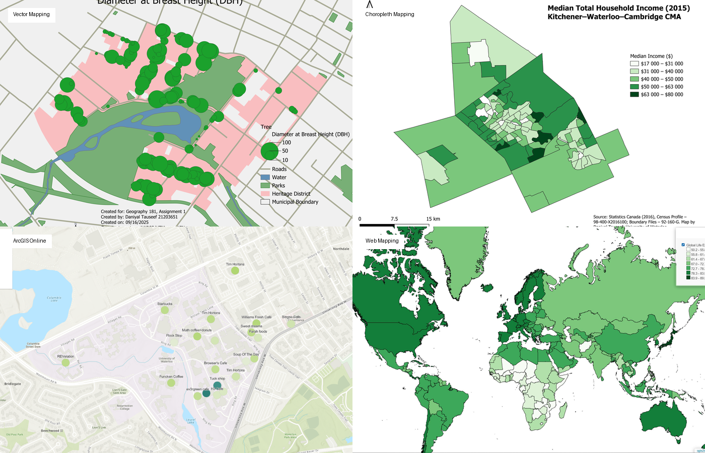

## Overview

SpatialWorks brings together smaller geospatial projects that demonstrate core GIS and cartographic skills across multiple workflows. Rather than presenting individual course assignments as separate repositories, this portfolio highlights the strongest outputs and the techniques behind them.

| Area | Skills demonstrated |
| --- | --- |
| Map projections | CRS selection, projection distortion, equal-area vs. conformal trade-offs |
| Proportional symbols | Mapping population totals across multiple geographic scales |
| Choropleth mapping | Rates and ratios, classification, sequential and diverging colour schemes |
| Vector mapping | Point, polygon, census, bathymetry, and basemap integration |
| Field GIS | Mobile GPS collection, Survey123, attributes, photos, data quality |
| ArcGIS Online | Hosted layers, filtering, labels, proportional symbols, derived metrics |
| Web mapping | Interactive popups, hover highlighting, layer controls, scale-dependent visibility |

## Featured Work

### 1. Map Projections

Comparison of several world projections to examine how coordinate reference systems change area, shape, direction, and distance.

- **World Sinusoidal** — equal-area projection suited to comparisons where area matters.
- **WGS 84 / Pseudo-Mercator** — conformal locally, but strongly inflates area at high latitudes.
- **Equidistant Cylindrical** — preserves selected distance relationships while introducing other distortions.
- **Van der Grinten I** — compromise projection that balances multiple types of distortion.

  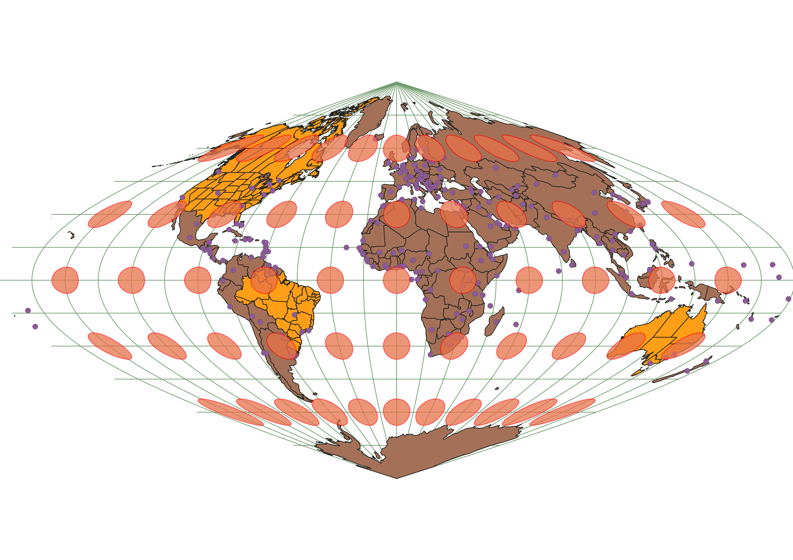
  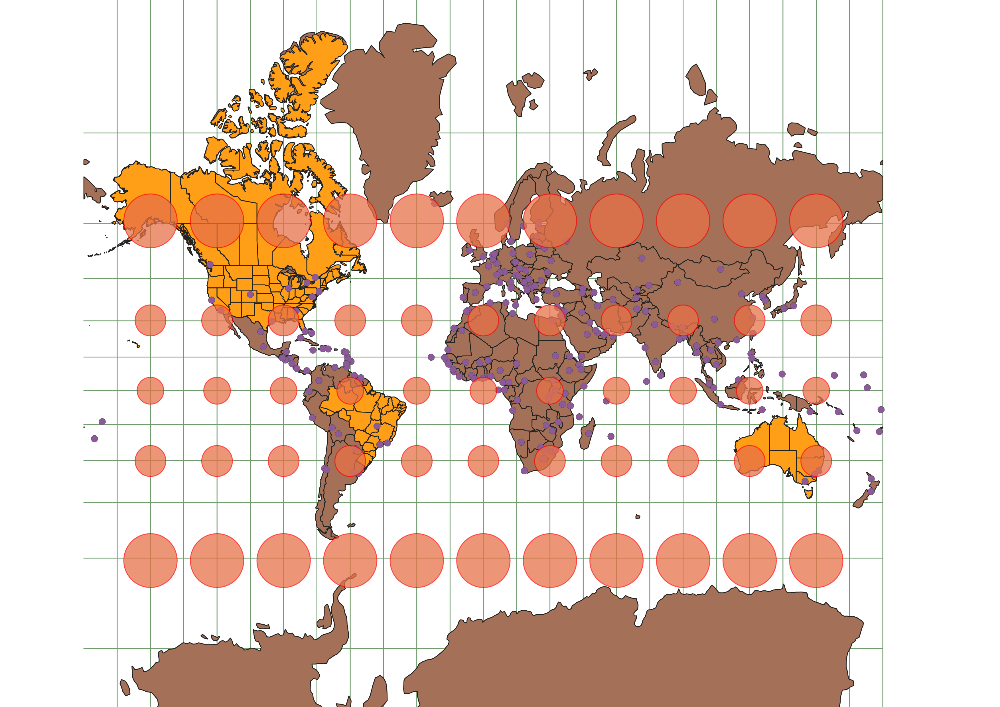

[View all projection maps](projections/)

### 2. Proportional-Symbol Mapping

Population totals were mapped with proportional symbols at national, provincial, and metropolitan scales. The work demonstrates an important cartographic distinction: **counts are better represented with proportional symbols than choropleth shading**.

  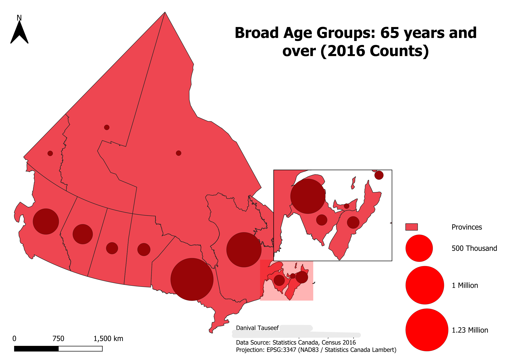
  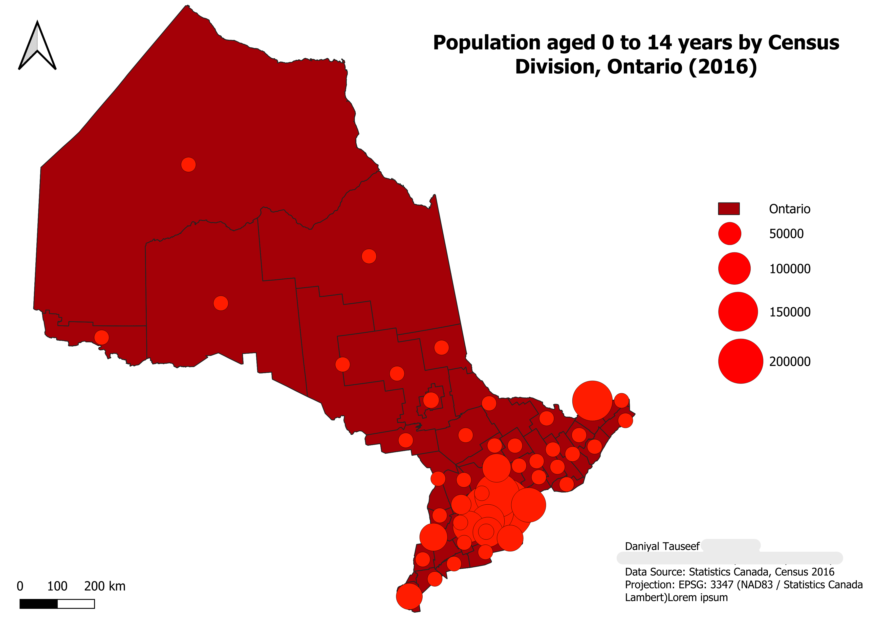

[View proportional-symbol maps](proportional-symbols/)

### 3. Choropleth Mapping

Three thematic maps explore demographic and socioeconomic patterns using rates, ratios, and normalized values rather than raw totals.

- Population aged 65+ in the Toronto CMA
- Population change from 2006 to 2016 across Canada
- Median household income in the Kitchener-Waterloo-Cambridge CMA

  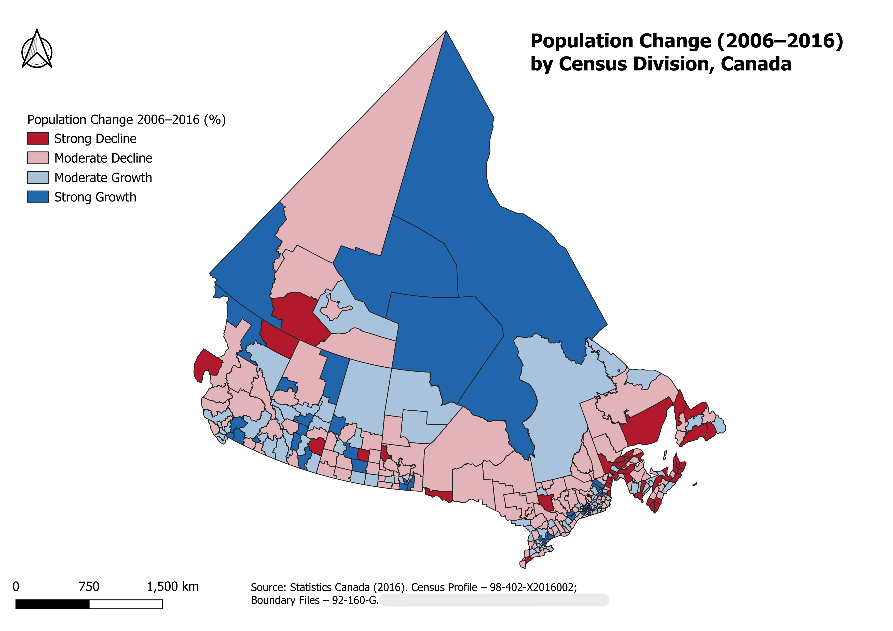
  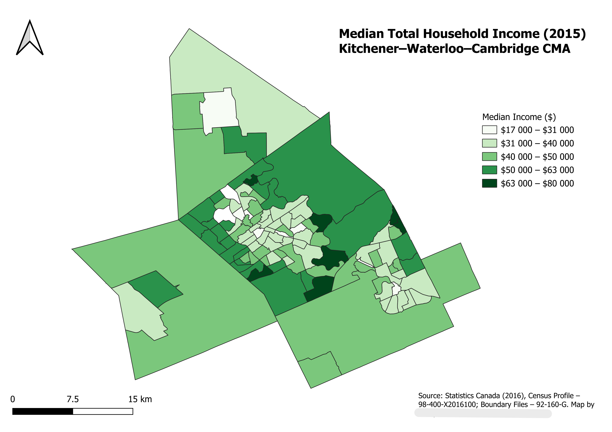

[View choropleth maps](choropleths/)

### 4. Vector Mapping and Data Integration

These maps demonstrate integration of multiple vector datasets and external spatial sources.

**Victoria Park Tree Inventory** uses point features, attributes, filtering, and cartographic symbology to visualize street trees by diameter at breast height.

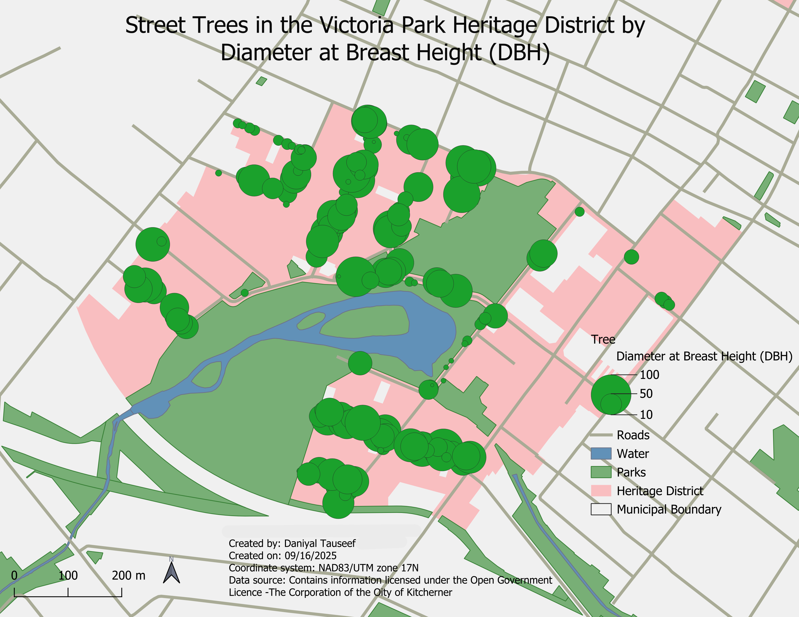

**Toronto Homicides and Historical Census Geography** combines Toronto homicide locations, 1961 census tracts, Great Lakes bathymetry, and a web basemap in one QGIS composition.

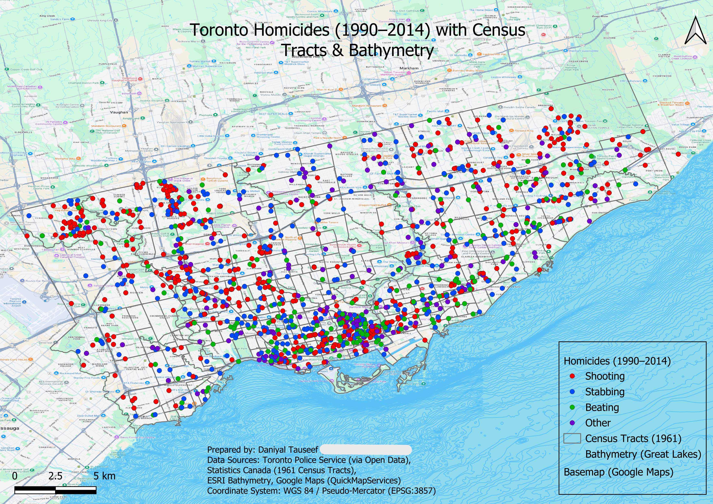

[View vector mapping work](vector-mapping/)

### 5. Field GIS and ArcGIS Online

A campus coffee-shop census was collected using **ArcGIS Survey123** and later analyzed in **ArcGIS Online**. The workflow included mobile GPS collection, attribute entry, hosted feature layers, proportional symbols, labeling, filtering, and creation of a derived "Best Value" metric.

  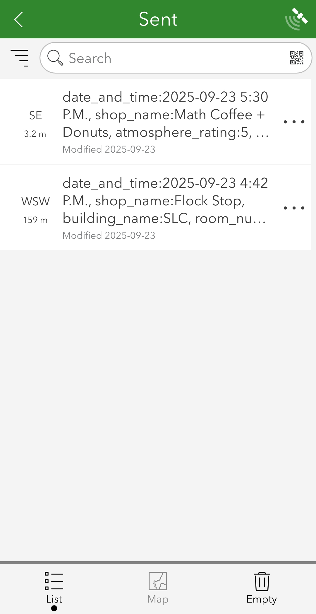
  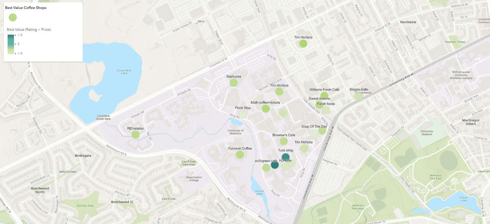

[View field GIS work](field-gis/)

### 6. Interactive Web Mapping

Interactive maps were created with controls not available in static layouts, including:

- layer toggles;
- feature popups;
- hover highlighting;
- zoom controls;
- scale bars;
- scale-dependent visibility;
- query-based feature filtering.

The examples include a global life-expectancy web map and a municipal map whose roads, parks, trails, and boundaries change visibility by map scale.

  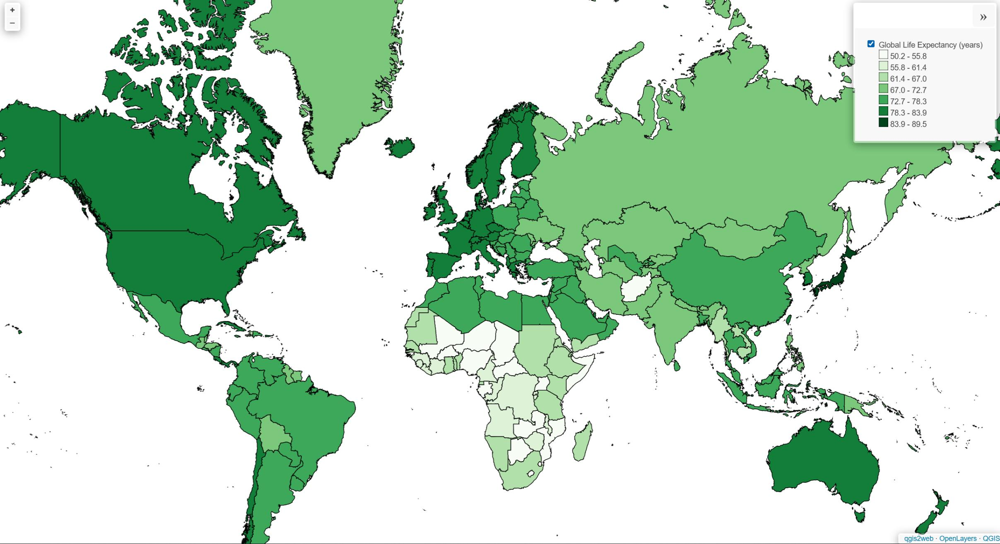
  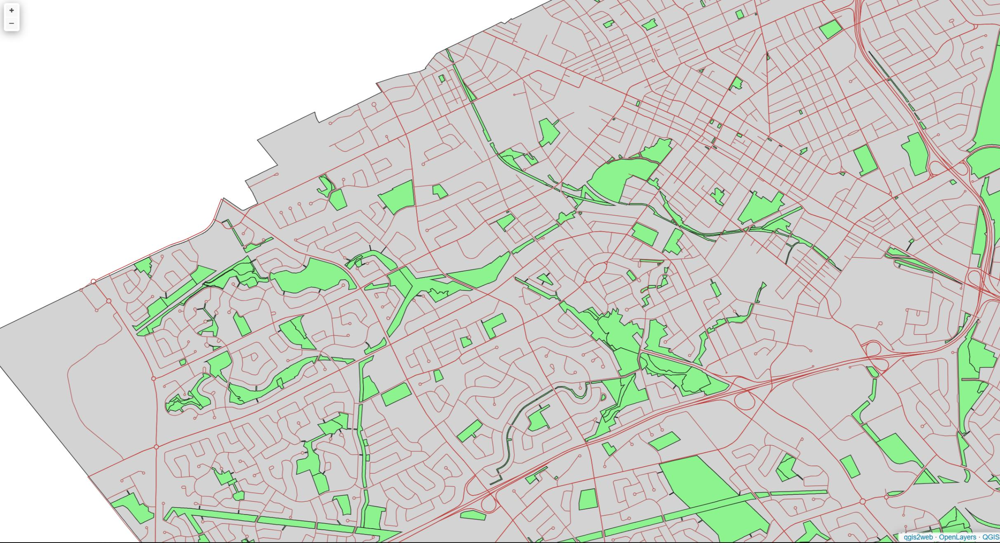

[View web mapping examples](web-mapping/)

## Tools and Technologies

- **QGIS**
- **ArcGIS Online**
- **ArcGIS Survey123**
- Shapefiles and vector feature data
- CSV and tabular attribute data
- Coordinate reference systems and map projections
- Census geography
- Hosted feature layers
- Web maps and interactive cartography

## Portfolio Context

These projects originated from university geospatial coursework and have been curated here as a portfolio of selected work.
